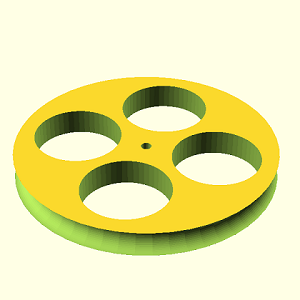
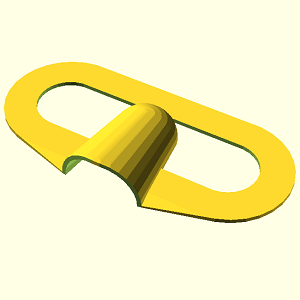

# Zadání cvičení na OpenSCAD #2

## Hodnocení
* Vaším úkolem je přihlásit se k úkolu pomocí tohoto linku: https://classroom.github.com/a/RGZNdMSw
  * Kompletní řešení 1 úlohy (1 bod)
  * Úloha nesplňuje zadání (0 bodů)
  * Maximální bodový zisk je 3 body, čili když uděláte více jak 3 úlohy spravně děláte to pouze pro váš dobrý pocit.

## Možné bodové srážky 

  * Úloha musí být napsána jako modul (jinak 0 bodů)
  * Úloha nereaguje vůbec nebo reaguje nesprávně na parametr (-1/(počet parametrů úlohy) bodu)
  
## Dodatek

  * Tentokrát se ujistěte, že máte modely orientované a napozicované stejně, jako testy, aby mohla být vizuální kontrola přesnější. Můžete si na pomoc vzít STL soubory.

### Úlohy

|              STL soubor                 |                  Obrázek                    |
| --------------------------------------- | ------------------------------------------- |
| [Arm](stls/arm.stl)                     |                       |
| [Batman](stls/batman.stl)               |                 |
| [Disc](stls/disc.stl)                   |                     |
| [Helix](stls/helix.stl)                 |                   |
| [Mask](stls/mask.stl)                   |                     |
| [Snowman](stls/snowman.stl)             |               |
| [Whistle](stls/whistle.stl)             |               |